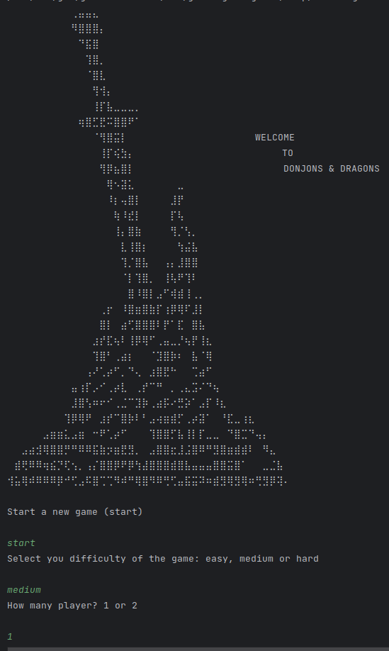
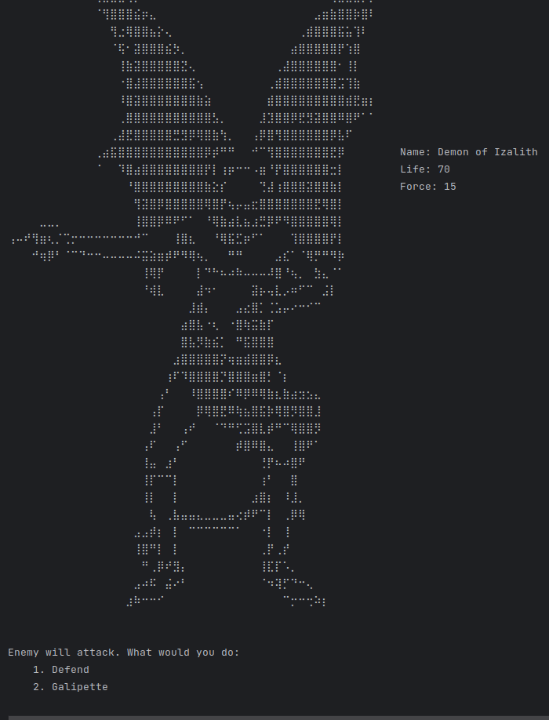

# Project on Java: The Game of Donjons & Dragons

> A console based version of Dungeons and Dragons written entirely in Java
> linked to a MySQL database to store the Hero and it's attributes.

## Brief explanation of the game

- A player(Hero) is created and storage on the database.
- A game with one or two players and different difficulties.
- The game board is randomly initialized with enemies and chest increasing by position on the board.
- Hero moves forward on the board and combats enemies when encountered
- If the hero survives he level up and get a random item.
- A backpack for managing and exchanging hero equipment.

## Screenshot

